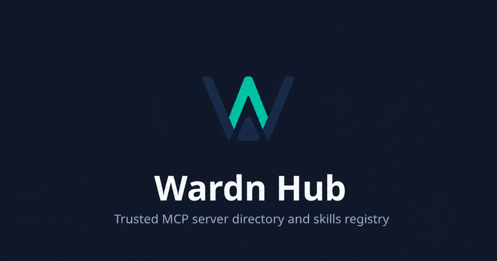

<p align="center">
  <a href="https://hub.wardnai.dev">
    
  </a>
</p>

<h1 align="center">Wardn Hub</h1>

<p align="center">
  <strong>Publish, discover, and evaluate MCP servers and agent skills from one open registry.</strong>
</p>

<p align="center">
  <a href="https://hub.wardnai.dev"><strong>Explore Wardn Hub</strong></a>
  ·
  <a href="https://www.npmjs.com/package/@wardn-ai/skills"><strong>Install the Skills CLI</strong></a>
  ·
  <a href="https://github.com/abhi1693/wardn-hub/issues"><strong>Contribute</strong></a>
</p>

<p align="center">
  <a href="https://github.com/abhi1693/wardn-hub/actions/workflows/tests.yml"></a>
  <a href="https://github.com/abhi1693/wardn-hub/actions/workflows/security.yml"></a>
  <a href="https://github.com/abhi1693/wardn-hub/actions/workflows/container.yml"></a>
  <a href="https://github.com/abhi1693/wardn-hub/releases/latest"></a>
  <a href="https://www.npmjs.com/package/@wardn-ai/skills"></a>
  <a href="LICENSE"></a>
</p>

Wardn Hub turns fragmented repository metadata into a structured, searchable
catalog. MCP server definitions gain version history, ownership, transport and
package metadata, review state, and publication controls. Agent skills gain
content-addressed snapshots, provenance, security analysis, and a safe delivery
path through the `@wardn-ai/skills` CLI.

> [!IMPORTANT]
> Wardn Hub is a registry and governance system. It does not run MCP servers,
> invoke MCP tools, install workspace MCP configuration, or provide an execution
> gateway.

## Why Wardn Hub

- **Useful discovery, not a link collection.** Compare installation metadata,
  transports, environment variables, versions, namespaces, documentation, and
  support information in a consistent model.
- **Trust that follows the artifact.** Skill audits are bound to an exact
  snapshot, so an updated bundle cannot inherit an old result. Scanner and LLM
  configuration remains attached as provenance without invalidating an
  unchanged snapshot.
- **A publication workflow built for maintainers.** Draft, validate, review,
  approve, reject, withdraw, and publish MCP server submissions without losing
  provenance or audit history.
- **Safe, agent-native skill delivery.** Search, inspect, fetch, install, update,
  and remove complete skill bundles with bounded downloads and hash pinning.
- **Open and self-hostable.** FastAPI, PostgreSQL, Next.js, generated OpenAPI
  clients, and Apache-2.0 licensing keep the platform inspectable and portable.

## What the platform provides

| Area | Capabilities |
| --- | --- |
| MCP catalog | Versioned server definitions, categories, packages, remotes, transports, namespace ownership, documentation, and support metadata |
| Submission governance | Drafts, source imports, schema validation, moderation, publication, rejection, withdrawal, appeals, and audit history |
| Agent skills | GitHub discovery, recursive `SKILL.md` imports, exact source-path identity, snapshot history, official publishers, and install telemetry |
| Security analysis | Cisco AI Skill Scanner integration, deterministic 0–100 scores, severity ceilings, category deductions, and GitHub-style ranks |
| Access control | Local authentication, OpenID Connect, organizations, memberships, roles, scoped API tokens, and superuser administration |
| Automation | Event rules, webhook deliveries, GitHub refresh jobs, moderation workers, OpenTelemetry traces, Prometheus metrics, and structured logs |

## Try the skills registry

The published CLI runs directly with `npx`; no global installation is required.

```sh
npx -y @wardn-ai/skills search "postgres" --limit 5
```

Resolve a skill through the complete audit and inspection flow:

```sh
npx -y @wardn-ai/skills search "code audit" --limit 8 --json
npx -y @wardn-ai/skills audit owner/repository/skill-slug --json
npx -y @wardn-ai/skills inspect owner/repository/skill-slug --json
npx -y @wardn-ai/skills fetch-bundle owner/repository/skill-slug --json
```

Install a selected snapshot for an agent:

```sh
npx -y @wardn-ai/skills install owner/repository/skill-slug \
  --global \
  --agent codex
```

Add `--hash <contentHash>` using the value returned by `audit --json` to pin the
installation to the exact snapshot you reviewed.

Built-in targets include Codex, Claude Code, Cursor, OpenCode, Gemini CLI,
GitHub Copilot, and the universal Agent Skills directory. Installs and updates
are staged atomically; the CLI refuses unsafe paths, symlinks, malformed or
oversized bundles, and unmanaged directory collisions.

Best-effort anonymous install telemetry is enabled by default. It contains the
public skill ID, content hash, CLI identifier, and CLI version—never source code,
local paths, task context, user identity, or device identity. Delivery failures
never fail or roll back an install.

See the [Skills CLI guide](hub/cli/README.md) for lifecycle commands, custom
targets, snapshot pinning, and telemetry controls.

## Architecture

```text
 GitHub repositories ──► import / refresh / audit workers ──┐
                                                           │
 Browser ──► Next.js frontend ──► FastAPI ──► PostgreSQL ◄─┤
                                                           │
 Agents ──► @wardn-ai/skills CLI ──────────────────────────┘
```

| Path | Responsibility |
| --- | --- |
| `hub/backend` | FastAPI routes, SQLAlchemy models, Alembic migrations, registry services, workers, and tests |
| `hub/frontend` | Next.js catalog, submission and administration interfaces, metadata pages, and generated API client |
| `hub/cli` | Publishable `@wardn-ai/skills` package for discovery and managed skill installation |
| `hub/codex-app-server` | Container wrapper used by optional submission review and repair automation |
| `skills/find-skills` | Script-free bootstrap skill that delegates discovery to the published CLI |

Core conventions:

- API prefix: `/api/v1`
- Settings prefix: `WARDN_HUB_`
- Backend: Python 3.12+, FastAPI, SQLAlchemy, Alembic, PostgreSQL
- Frontend: Node.js 24, Next.js 16, React 19
- API client: OpenAPI plus Orval
- Container platform: `linux/arm64`

## Run Wardn Hub locally

### Prerequisites

- Python 3.12 or newer
- [uv](https://docs.astral.sh/uv/)
- Node.js 24 and npm
- PostgreSQL

The repository intentionally does not include a Docker Compose stack. Run
PostgreSQL using your preferred local environment and update
`WARDN_HUB_DATABASE_URL` accordingly.

### 1. Start the API

```sh
cd hub/backend
cp .env.example .env
# Edit .env with your PostgreSQL connection details.

uv sync --extra dev
uv run alembic upgrade head
uv run python -m app.manage seed-categories
uv run uvicorn app.main:app --reload --host 0.0.0.0 --port 8000
```

The API is available at `http://localhost:8000`. Create the first administrator
while the database has no users:

```sh
curl --request POST http://localhost:8000/api/v1/users/bootstrap \
  --header 'Content-Type: application/json' \
  --data '{
    "email": "admin@example.com",
    "password": "replace-this-local-password",
    "first_name": "Admin",
    "last_name": "User"
  }'
```

### 2. Start the frontend

In another terminal, from the repository root:

```sh
npm ci
npm run web:dev
```

Open `http://localhost:3000`. The Next.js server proxies `/api/v1` to
`http://localhost:8000` by default.

### 3. Open the API documentation

- Swagger UI: `http://localhost:8000/api/v1/docs`
- OpenAPI JSON: `http://localhost:8000/api/v1/openapi.json`
- Live reference: [hub.wardnai.dev/docs/api](https://hub.wardnai.dev/docs/api)

## MCP registry and submissions

Wardn Hub stores stable `publisher/server` identities and versioned server
documents compatible with the MCP registry schema. A publishable definition
contains at least one package or remote target and can include:

- package registry, identifier, version, command, arguments, and environment;
- streamable HTTP or SSE endpoints, authentication hints, headers, and query
  parameters;
- repository, documentation, website, icons, categories, and ownership;
- moderation state, partner support, quality signals, and version history.

Source imports can seed a submission draft from repository metadata,
`server.json`, `mcp.json`, package manifests, and project documentation. Drafts
remain editable until they are submitted for review.

Primary API groups:

| Area | Prefix |
| --- | --- |
| Authentication and API tokens | `/api/v1/auth` |
| Users and organizations | `/api/v1/users`, `/api/v1/organizations` |
| MCP catalog and categories | `/api/v1/mcp`, `/api/v1/mcp/categories` |
| Imports and submissions | `/api/v1/imports`, `/api/v1/submissions` |
| Skills | `/api/v1/skills` |
| Partners and support | `/api/v1/partners` |
| Events and audit history | `/api/v1/events`, `/api/v1/audit/events` |

## Skill ingestion and auditing

Import one repository or a bounded GitHub scope from `hub/backend`:

```sh
uv run python -m app.manage skills import-github \
  --repo github/awesome-copilot \
  --subfolder skills \
  --recursive \
  --output text
```

Text-mode rate-limit warnings include the exact wait in seconds, retry attempt,
primary or secondary limit classification, GitHub resource and reset epoch,
request ID, and request host/path.

The GitHub client honors `Retry-After` plus a one-second buffer when GitHub
provides it. For an exhausted primary limit it waits until
`x-ratelimit-reset`, also with a one-second buffer. When a secondary-limit
response provides neither value, waits start at 60 seconds and back off through
120, 240, 480, and 900 seconds. A request stops after those five retries so an
import cannot wait forever. The client also remembers the `core`, `search`, and
`code_search` budgets reported by successful responses; if one reaches zero,
the next request for that resource waits until its reset before being sent.

Authenticated API responses with an ETag are cached in PostgreSQL and replayed
when GitHub returns `304 Not Modified`, allowing conditional requests to survive
separate importer jobs. Cache keys include a one-way token scope so responses
from different credentials cannot collide; credentials themselves are never
stored. The cache accepts responses up to 2 MiB and is pruned to 4,096 entries
and 64 MiB. Cache load or persistence failures are non-fatal and fall back to
ordinary GitHub requests.

Public skill-search responses can be cached in Valkey by enabling
`WARDN_HUB_CACHE_ENABLED`. The API stores only final serialized response bytes
with native Valkey TTLs; it keeps no local entry cache, bounds both payload size
and connection pools, and treats cache failures as misses. Cache keys are
environment-scoped, versioned, and hash all query material.

Refresh existing skills from their recorded branch and exact source path:

```sh
uv run python -m app.manage skills refresh
```

Run pending audits manually:

```sh
WARDN_HUB_SKILL_AUDIT_ENABLED=true \
uv run python -m app.manage skills audit
```

The importer packages only the files owned by each `SKILL.md` directory. Paths
remain relative to the root `SKILL.md`, so scripts, references, templates, and
assets in that directory work without rewriting. References that leave the skill
directory are not followed, even when they point to another imported skill.
Optional missing references are recorded without blocking the package, while a
required missing or escaping reference rejects the skill instead of storing an
incomplete package. If an existing skill becomes incomplete during refresh, its
catalog record and dependent snapshots and audits are removed. Packages remain
bounded to 256 files, 8 MiB per file, and 16 MiB total; symlinks, submodules,
build directories, and unsafe paths are excluded. Existing GitHub snapshots are
marked pending by the migration and either become self-contained format 2
packages or are removed on their next refresh.

Slug identity remains repository-local. Deterministic SHA-256 suffixes are used
only when normalized slugs collide within the same repository, and re-importing
the same source path updates its existing record.

When `WARDN_HUB_SKILL_AUDIT_ENABLED=true`, imports and refreshes drain the
pending-audit queue after their GitHub phase. The pinned Cisco AI Skill Scanner
runs static/YARA, bytecode, pipeline, and behavioral analysis. Its optional LLM
analyzer has a separate `WARDN_HUB_SKILL_AUDIT_LLM_ENABLED` gate; Cisco AI
Defense, meta analysis, and VirusTotal are not enabled by Wardn Hub.

Package compatibility is independent from security analysis: an incomplete or
malformed import is rejected instead of receiving a security score of zero.
Audit results are attached to the exact snapshot and include findings,
analyzers, policy fingerprint, configuration hash, score deductions, a score
from 0 to 100, and ranks from `S` through `C`. A content change makes the
previous result ineligible until the new snapshot is scanned. Scanner and LLM
configuration changes are retained as audit provenance and do not enqueue
unchanged snapshots for another paid scan; use `--reaudit` when a deliberate
policy change requires replacement results.

## Configuration

Copy [`hub/backend/.env.example`](hub/backend/.env.example) for local defaults.
Production deployments must replace placeholder secrets and use independent,
high-entropy session and API-token keys.

| Variable | Purpose |
| --- | --- |
| `WARDN_HUB_ENVIRONMENT` | Runtime environment; production values enable stricter validation |
| `WARDN_HUB_DATABASE_URL` | PostgreSQL SQLAlchemy URL |
| `WARDN_HUB_SESSION_SECRET` | Session-cookie signing secret |
| `WARDN_HUB_API_TOKEN_SECRET` | API-token signing secret |
| `WARDN_HUB_CORS_ORIGINS` | Comma-separated browser origins allowed by the API |
| `WARDN_HUB_REGISTRY_PUBLIC_BASE_URL` | Canonical public URL and default OIDC callback base |
| `WARDN_HUB_AUTH_PROVIDERS` | Enabled authentication providers: `local`, `oidc`, or both |
| `WARDN_HUB_OIDC_*` | Issuer, client, callback, scope, domain, and account-provisioning settings |
| `WARDN_HUB_SKILL_AUDIT_ENABLED` | Master gate for skill auditing and audit exposure |
| `WARDN_HUB_SKILL_AUDIT_LLM_ENABLED` | Separate gate for the scanner's semantic LLM analyzer |
| `SKILL_SCANNER_LLM_*` | LLM provider, model, key, endpoint, API version, and temperature |
| `WARDN_HUB_VALKEY_*` | Shared direct or Sentinel Valkey connection used by bounded remote state clients |
| `WARDN_HUB_PUBLIC_RATE_LIMIT_*` | Valkey-backed public API and telemetry rate limiting |
| `WARDN_HUB_CACHE_*` | Stateless Valkey response caching, including DB, TTL, value, timeout, and connection bounds |
| `WARDN_HUB_OTEL_*` | OpenTelemetry service, exporter, resource, and sampling settings |

Frontend routing and metadata use:

| Variable | Purpose |
| --- | --- |
| `WARDN_HUB_API_INTERNAL_BASE_URL` | API URL reached by the Next.js server; defaults to `http://localhost:8000` |
| `NEXT_PUBLIC_SITE_URL` | Canonical frontend URL for metadata, robots, and sitemaps |
| `NEXT_PUBLIC_REGISTRY_PUBLIC_BASE_URL` | Public registry URL used in generated badge Markdown |
| `NEXT_PUBLIC_API_BASE_URL` | Optional direct browser API URL; same-origin `/api/v1` is the default |

Consult the example environment file and
[`hub/backend/app/core/config.py`](hub/backend/app/core/config.py) for the
complete set of validated settings.

## Authentication and authorization

Local credentials and generic OpenID Connect are supported. OIDC deployments
register the following public callback:

```text
{WARDN_HUB_REGISTRY_PUBLIC_BASE_URL}/api/auth/oidc/callback
```

The backend performs provider discovery and token exchange; the browser receives
only the signed Wardn Hub session cookie. Verified-email enforcement, domain
allowlists, automatic account creation, and superuser promotion are configurable.
Organizations, roles, memberships, partner records, and scoped API tokens supply
the authorization model beyond initial sign-in.

## Development workflow

Run all checks from the repository root:

```sh
npm run backend:lint
npm run backend:test
npm run cli:check
npm run web:lint
npm run web:build
```

After changing backend routes, schemas, or OpenAPI metadata, regenerate and
commit the API artifacts:

```sh
npm run web:api:generate
```

| Command | Result |
| --- | --- |
| `npm run backend:lint` | Ruff validation for the backend |
| `npm run backend:test` | Complete pytest suite |
| `npm run cli:check` | Typecheck, tests, build, and npm package dry-run |
| `npm run web:lint` | Frontend ESLint validation |
| `npm run web:build` | Next.js production build and Faro source-map preparation |
| `npm run web:api:generate` | OpenAPI export and Orval client generation |

CI repeats these checks and adds gitleaks, `npm audit`, and `pip-audit` security
scans.

## Contributing

Contributions are welcome across catalog UX, API design, ingestion reliability,
security analysis, moderation workflows, documentation, and operational tooling.

1. Open or select an [issue](https://github.com/abhi1693/wardn-hub/issues).
2. Create a focused branch and keep unrelated changes out of the patch.
3. Add tests for behavior changes and regenerate API artifacts when schemas move.
4. Run the complete development checks above.
5. Submit a pull request explaining the problem, design, validation, and any
   migration or deployment impact.

Good first contributions include focused accessibility fixes, clearer empty and
error states, import fixtures for unusual repository layouts, scanner result
normalization tests, and documentation improvements grounded in real workflows.

## Containers and releases

Build the application images locally:

```sh
docker build --tag wardn-hub-backend --file hub/backend/Dockerfile hub/backend
docker build --tag wardn-hub-frontend --file hub/frontend/Dockerfile .
```

Published GitHub releases produce `linux/arm64` images:

- `ghcr.io/abhi1693/wardn-hub-backend:<version>`
- `ghcr.io/abhi1693/wardn-hub-frontend:<version>`
- `ghcr.io/abhi1693/wardn-hub-codex-app-server:<version>`

The backend listens on port `8080`; the frontend listens on port `3000`.
Database migrations must complete before new backend code begins serving
traffic. The Codex app-server image is optional and supports submission review
automation rather than MCP execution.

## Project boundaries

Wardn Hub deliberately excludes execution-plane responsibilities:

- workspace MCP installation;
- MCP tool invocation;
- Kubernetes runtime management;
- proxying or gateway execution for registered servers.

Keeping those concerns outside the registry preserves a smaller security
boundary and makes the catalog useful across runtimes and deployment models.

## License

Wardn Hub is available under the [Apache License 2.0](LICENSE).
